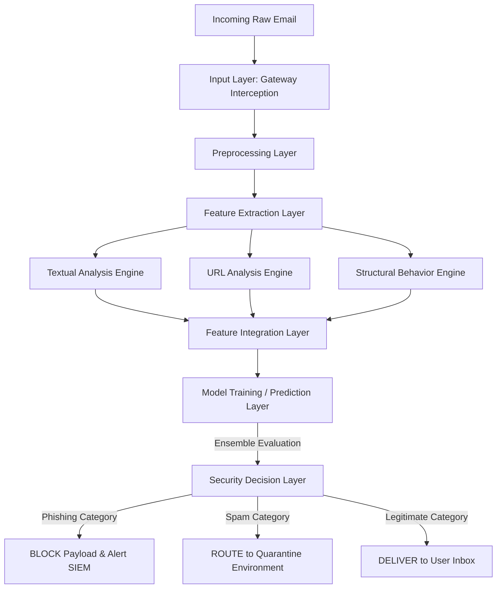

# Multi-Class Email Threat Detection and Prevention System Using Feature-Based Analysis

## 1. Abstract and Security Relevance
The "Multi-Class Email Threat Detection and Prevention System Using Feature-Based Analysis" is a comprehensive defensive mechanism designed to operate at the organizational email gateway. Unlike traditional reactive threat intelligence feeds or generic keyword blacklists, this system inspects incoming mail traffic dynamically. By leveraging multi-dimensional feature extraction across text, URL, and structural components of an email payload, the system models the behavioral heuristics of threat actors. 

This project operates fundamentally as an advanced **preventative security control**. By shifting left in the attack kill chain, the architecture preempts phishing attempts and spear-phishing payloads before they can infiltrate an end-user's inbox, thereby drastically reducing the attack surface related to socially engineered initial access vectors.

## 2. Core Functional Overview
The system acts as an inline security layer intercepting intra-domain and external inbound traffic. 
Its core functionalities include:
- **Comprehensive Traffic Inspection:** Transparently ingesting email bodies, metadata, subjects, and embedded hypermedia (URLs) for deep analysis.
- **Multidimensional Behavior Analysis:** Escaping the limitations of singular keyword matching by creating topological and structural representations of the email.
- **Micro-Segmentation Classification:** Dynamically classifying traffic into three distinct operational states: `Legitimate`, `Spam`, and `Phishing`.
- **Automated Security Enforcement (Gateway Layer):**
  - **Legitimate → Deliver:** Whitelisted routing to the destination mailbox.
  - **Spam → Quarantine:** Rerouted to a controlled, isolated sandbox for administrative review or user-initiated release.
  - **Phishing → Block and Alert:** Black-holing the traffic, initiating a drop sequence, and generating actionable alerts to the Security Operations Center (SOC) containing IOCs (Indicators of Compromise).

## 3. System Architecture Design
The integration of machine learning within an Information Security context requires a robust pipeline. The system employs a decoupled, multi-layered architecture:

1. **Input Layer (Gateway Interception):** Captures the raw SMTP/IMAP protocol payload. Parses MIME structures to independently isolate headers, body text, attachments, and raw HTML links.
2. **Preprocessing Layer:** Normalizes data through tokenization, stop-word removal, and HTML sanitization. Defangs URLs for safe parsing without accidental detonation.
3. **Feature Extraction Layer:** The core analytic engine executing three parallel extraction routines (Textual, URL, and Structural). Converts abstract email data into quantifiable feature vectors.
4. **Feature Integration Layer:** Fuses the outputs of the three parallel extractors into a unified, high-dimensional vector space representing the holistic behavioral signature of the email.
5. **Model Training Layer:** Orchestrates the algorithmic learning utilizing Support Vector Machines, Random Forests, and Multinomial Naïve Bayes.
6. **Evaluation Layer:** A continuous validation subsystem that benchmarks the classification matrix, strictly prioritizing minimal False Negatives (high recall) for the destructive `Phishing` class.
7. **Security Decision Layer (Enforcement Engine):** Translates the mathematical output of the classification model into concrete security policies (Deliver, Quarantine, Block) and dispatches required SIEM alerts.

### 3.1 Architecture Workflow Diagram
*(Conceptual flow of how raw email transforms into a security action.)*

## 4. Feature Engineering Methodology
Successful detection of sophisticated threats relies on analyzing *how* an email is constructed rather than just *what* it says. The system engineers features across three distinct vectors:

### 4.1. Textual Analysis (Semantic Payload)
Identifies the communicative intent and psychological manipulation tactics inherent to the payload.
- **TF-IDF Representation:** Quantifies word importance, exposing anomalous vocabulary distributions atypical of standard corporate communication.
- **Suspicious Keyword & Financial Request Detection:** Flags terminology linked to credential harvesting or financial redirection.
- **Urgency Language Patterns:** Analyzes sentiment and imperativist phrasing (e.g., "Account suspended," "Immediate action required") traditionally used to circumvent user cognitive scrutiny.

### 4.2. URL Analysis (Network Indicators)
Assesses the structural composition of requested external network resources.
- **URL Length & Obfuscation Lengths:** Detects excessive padding used to hide malicious domains.
- **Domain Dispersion (Number of Dots):** Identifies highly nested subdomains typically utilized in fast-flux phishing campaigns or subdomain takeovers (e.g., `login.microsoft.secure.update.com`).
- **IP-Based Routing Detection:** Flags URLs relying directly on IPv4/IPv6 addresses rather than resolvable DNS mappings, a strong indicator of ephemeral malicious hosting.
- **Special Character Patterns:** Evaluates the presence of URL encoding, `@` symbols to bypass authentication, or hyphens disguising brand names.

### 4.3. Structural Behavior Analysis (Payload Topology)
Analyzes the visual or structural presentation intended to deceive the recipient.
- **Capitalization Matrix:** Tracks the frequency of fully capitalized words indicating aggression or forced urgency.
- **Punctuation Anomalies:** Measures the density of exclamation marks or unusual character clusters.
- **Overall Length Profile:** Correlates the briefness or excessive length against known normal baselines.
- **Link-to-Text Ratio:** An extremely effective heuristic; emails containing almost no textual context but housing multiple redirect links have a severe risk profile.

## 5. Machine Learning Component & Evaluation
The core engine relies on comparing deterministic, probabilistic, and ensemble methods to optimize performance. The system evaluates:
- **Multinomial Naïve Bayes:** Evaluates probabilistic likelihood based on word frequency. Fast and excellent for generic spam text baselining.
- **Support Vector Machine (SVM):** Utilizes a hyperplane to map complex, non-linear boundaries between Legitimate and Phishing edge cases.
- **Random Forest:** An ensemble decision tree structural model that provides high resistance to overfitting and robust feature importance weighting.

**Core Evaluation Philosophy:**
While standard metrics (*Accuracy, Precision, F1-Score*) are computationally relevant, from a security architecture standpoint, the system is tuned for **High Recall in Phishing Detection**. 
- A *False Positive* (Legitimate email quarantined) is an operational inconvenience.
- A *False Negative* (Phishing email delivered) is a critical security breach leading to compromised credentials and ransomware deployment. 
Therefore, the model selection strictly prioritizes maximal recall on the phishing class label.

## 6. Security Integration and Real-World Application
This system fundamentally differs from standard academic machine-learning classifiers by explicitly positioning itself within an enterprise infrastructure.

- **Gateway Inspection Layer:** Not operating post-delivery, the system inspects the transit layer via API integrations (e.g., MS Graph API for Exchange or Postfix filters).
- **Automated Response System:** Reduces alert fatigue for the SOC by automating the drop-and-block sequence for definitively malicious payloads, requiring human intervention only on borderline anomalies.
- **Continuous Threat Logging:** Blocked metadata (Sender IPs, malicious domains) are extracted and fed into the organization's SIEM (Security Information and Event Management) system, enabling broader proactive threat hunting across the network.

### 7. Conclusion and System Differentiation
Existing email defenses often rely heavily on static IOC (Indicator of Compromise) databases, which are easily evaded by zero-day attack infrastructure and polymorphic URLs. 

This formalized project marks a departure from static analysis toward a dynamic, behavior-first inspection pipeline. By simultaneously evaluating the intent (Text), destination (URL), and visual manipulation structure (Behavior) of an email, the framework acts as an intelligent proxy. This ensures organizations are secured against the rapidly mutating landscape of socially-engineered cyber threats, providing an actionable, enterprise-ready layered defense system.
